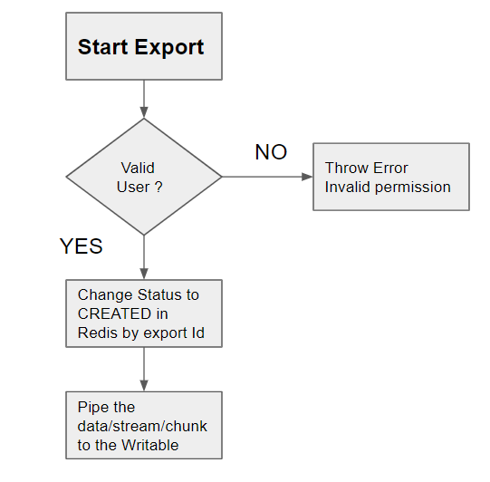

# Heartbeat engineering challenge

> 🚨 Please create a private fork of this repository and make all PRs into your own repository

Thank you for taking part in this and we are excited to see your work!

This repository contains a slimmed down version of an _exporter_ and associated
constructs for mocking functionality. There are three
tasks to complete.

The following files are simple mocks and need not be edited for the purpose
of this exercise.

```
1. src/logger.ts
2. src/permissions.ts
3. src/uuid.ts
```

## Tasks

### Task 1

Complete this README with a description of how the exporter works. You may
also add diagrams/code snippets, whatever you think is required ⭐️

**Tips**

1.  Read through the various files.
2.  Map out the high level system
    architecture and important functionality.
3.  (optional) Add comments to the `src/exporter.ts` file.

**What we are looking for**

1. Clear explanations of what individual elements are.
2. Some parts may be confusing, that's ok. We are looking for a
   thoughtful consideration of the different elements.
3. Your approach to documentation.

### Task 2a 🛠

**Please choose either 2a or 2b!**

We need new functionality adding. In addition to starting and fetching the
status of exports. **We would also like to cancel currently running exports**. Please implement
this functionality.

**Tips**

1. _We are looking for a minimum working example_, try focus on getting to something working.
   We can talk through your design and architecture decisions during the next interview.
2. The cancel existing import functionality should ideally **stop** an existing import. So no
   further bytes are piped from data source to the cache.
3. Bonus points for helpful test coverage on new code.

### Task 2b 🧪

**Please choose either 2a or 2b!**

The engineer who implemented this functionality forgot to add tests. We would like to cover
this feature with tests. Please add suitable tests for the exporter.

**Tips**

1. We are looking for how you approach testing code - be prepared to answer questions on why
   certain tests have been added!
2. Test names should be descriptive and help us understand why you chose to write that test.

### Task 3 📈

What would you improve? We know this feature isn't great. What would you change?

**Tips**

1. We are looking for ideas such as patterns, principles and performance.
2. You don't need to implement any improvements, but feel free to use code
   examples where you feel it would be helpful.

## How to submit

1. Create a private fork of this repository
2. Create a new branch in your fork
3. Commit on that branch
4. When you are ready to submit, create a PR back to your fork
5. Add the user @heartbeat-med (https://github.com/heartbeat-med)
6. We will comment on the PR
7. You can either submit more code or we can discuss in the next interview 🤘
8. Any questions, reach out to us!

## Start the application

Run the example with:

```shell
yarn start
```

Format code:

```shell
yarn format
```

### index.ts

1. Bootstrap the application with depdencies in `startApp()`
2. Start exporting with `exporter.StartExport`
3. Get the status of the export with the help of `exporter.GetExportStatus`

### exporter/exporter.ts

=> `StartExport` inputs are `user` and `input stream`.User is authorized as well .It intialize the status to CREATED in redis based on key `exportId`. It also pipe the `input stream` to `newCacheWriter`. It return `status` and `stopExport` fuction <br>
=> `stopExport` can be used to stop the export by closing the input stream. <br>
=> `GetExportStatus` is used to get the latest `status` from redis. <br>
=> `newCacheWriter` return writable. It appends the data (from the stream) to redis by key `exportid-data`. It also update the status to `PENDING` (while the write is in action). Final will change the status to `COMPLETED` and the expiry is set added accordingly. If the stream was not stop by the intiator. If the intiator stop the export by `stopExport` function. It will update the status to CANCELLED if the status is not COMPLETED and the expiry is set accordingly. <br>
=> `addExpiry` adds the expiry to the redis cache <br>
=> `updateStatus` adds the new status to the redis cache <br>
=> `checkAndUpdate` It checks the status and also check that the status needs to be updated or not <br>

### StopExport

1. It will be done step wise
2. `close` the `input stream` => Source needs to be closed
3. `unpipe` the `writable stream` => It should be detached from the writable stream
4. `destroy` the `writable stream` => It should destroy the writable stream to end the process. Destroy will not call final. final will only be called if the data is written successfully to the stream. Destroy event will be called anyways after the end event

---

Details about the project

Exporter at a glance:

1. This is a cache service. It is storing the data from the file to redis and setting a expiry of 60 min with a unique {exportid}. {exportid} is the unique used in redis to identify the cached data.

2. User authorization is also performed before starting an export.

3. Data can be very large and this is the reason data is fetched in stream or chunks

4. Data is then pipe/append in to redis and expiry is added acording to the configuration. Once the transfer is completed to redis, it will change the status to COMPLETED
   Data is stored as {exportid}-data as a key and status is stored against the {exportid} as key

5. If the intiator wants to stop the export. stopExport funciton is returned. Iniator can use this function to cancel the export.

6. StopExport will stop the stream/pipe/export and save the expiry to the redis. This will change the status to CANCELLED. If the status is already COMPLETED then it will not change the status to CANCELLED.

7. There is GetExportStatus function which retreived the status of the given export id

8. Expiry is added to status and data both

Status are also updated to redis, status are explained below

CREATED: This status is created when the export is just about to start. As the name suggest export is created.
PENDING: The exporter is writing the data to redis. it also update the status to pending
COMPLETED: The exporter has successfully updated the status.
CANCELLED: Intiator has cancelled the exported before the status is completed

More about the stopExport function
This is returned to the intiator at the first time. Count is added so that the function is used only one time.

Please find deep details about the files in the block diagram



